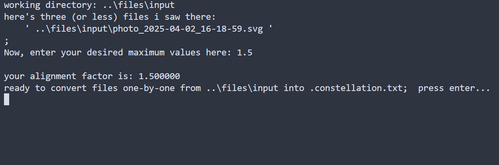

# использование

скачай собранный файл. на сайте с проектом он распологается под графой `Releases`, в разделе с `X tags`: кликни на `X tags` (под X имею в виду число, которое там есть), выбери самый последний и нажми на exe-шник. он начнёт скачиваться.

скачанный файл - это самораспаковывающийся 7zip-архив. запусти его и в появившемся окошке выбери папку, в которую он распакует файлы. примечание - он распакует ДВЕ папки, поэтому лучше создать рабочую папку заблаговременно.

нажми `extract`

перейди в папку, куда ты только что распаковал файлы.

в подпапку - `.\\files\\input\\.` помести svg-шки, которые хочешь конвертировать.

запусти `converter.exe` в папке `Release`.

в открывшемся консольном окне ты увидишь файлы, которые конвертер увидел. а так же ты должен будешь ввести максимальное значение для координат (на скриншоте - это "1.5") - в выходном файле не будет координат, превышающих это значение по вертикали и горизонтали, как в положительных числах, так и в отрицательных.

далее, чтобы конвертировать каждый файл - нажимай Enter каждый раз, когда программа останавливается.

конвертированные файлы будут тебя ждать в папке `.\\files\\.`;

# если хочешь сообщить об ошибках

запульни свой тикет о найденной проблеме в `Issues`!

# сборка

0. установи cmake, `git clone`'ни этот проект. я предполагаю, что у тебя уже стоит Visual Studio, а в месте с ним - и система сборки Visual C++, поэтому не буду заострять внимания на установке системе сборки.
1. открой консоль, перейди в директорию со склонированным проектом. введи `cmake -B build`, завари чай и жди, пока он сделает кэш для сборки проекта.
2. введи `cmake --build build`, выпей чай, пока он собирает этот проект.
3. наслаждайся собранными файлами в папке `Debug`. запусти `converter.exe` и ужаснись от функционала программы)
3.1 альтернативно - можешь ввести `cmake --build build --config Release` и наслаждаться собранным файлом не в папке `Debug`, а в папке `Release`.
